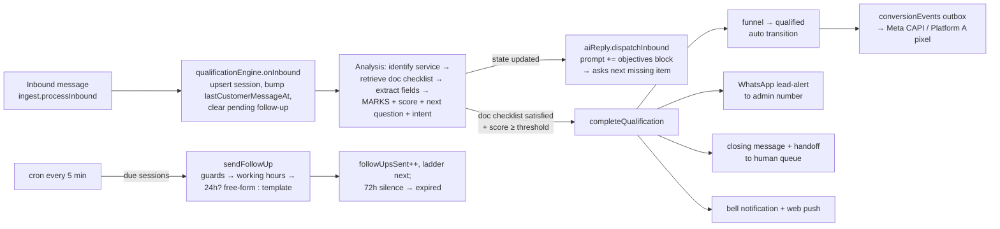
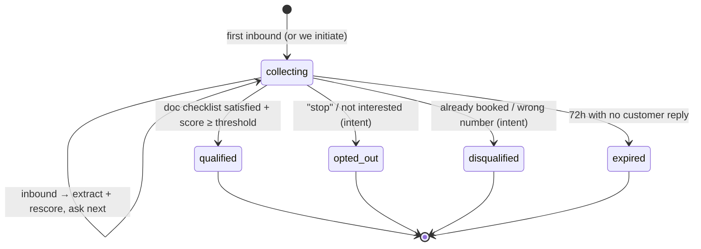

# Lead Qualification & Follow-up Engine — Design (v2)

**Status:** DRAFT v2 — awaiting owner approval (nothing implemented yet)
**Date:** 2026-07-18 (v2 same day: document-driven scoring, admin WhatsApp alert, lead detail + scoring UI)
**Scope:** wacrm2.0 (Convex backend + Next.js UI) + qualification sections added to the
AI knowledge-base drafts in `holidayys-ai-agent/`. No Platform A changes.

---

## 1. Problem & goals

Every WhatsApp conversation — whether the customer started it (ad click, organic) or we
started it (agent outreach, broadcast) — runs through a **qualification session**: the AI
assistant asks the qualifying questions **defined by each service's own knowledge-base
document**, an analysis pass extracts the answers and **gives marks (a lead score)**, and
if the customer goes quiet we follow up automatically (varied phrasing, working-hours
only, up to 3 days from their last reply).

When the service document's checklist is satisfied the lead is **qualified**: the funnel
stage advances, Meta gets the per-lead conversion signal automatically, **the admin gets
a WhatsApp message with the extracted lead details**, the sales team is notified in-app,
and every lead has its own detail view — answers, score breakdown, conversation — sorted
so sales works the highest-scoring leads first.

Three engines, one shared state:

| Engine | Job |
|---|---|
| **Qualification engine** | Owns the per-conversation session: lifecycle, state machine, completion, admin alert |
| **Analysis engine** | Identifies the service, pulls that service's qualification checklist from the knowledge base, extracts answers, **assigns marks per criterion + an overall score**, detects intent (opt-out / wants-human), and prepares the next question |
| **Follow-up engine** | Cron-driven re-asks when the customer stops replying: cadence ladder, working-hours clamp, 24-hour-window/template compliance, 3-day cap |

**No hardcoded qualification rule.** What to ask and what counts as qualified comes from
the service documents at runtime — every service is different, and the owner changes
behavior by editing the docs, not by redeploying. Off-topic / unmatched inquiries fall
back to a small basic-info set, get filled, and qualify on that basis.

## 2. What already exists (we build ON this, not beside it)

| Existing piece | Where | How this feature uses it |
|---|---|---|
| Inbound fan-out orchestrator | `convex/ingest.ts` `processInbound` (flows → automations + AI reply → webhook → push → new_lead conversion) | Two new best-effort hooks: session upsert + analysis |
| AI auto-reply (BYO key, RAG, handoff sentinel, reply cap) | `convex/aiReply.ts`, `src/lib/ai/defaults.ts` `buildSystemPrompt` | We inject a dynamic "qualification objectives" block into its system prompt; completion reuses `markHandoff` mechanics |
| Knowledge base + retrieval (semantic w/ lexical fallback) | `aiKnowledgeDocuments`/`aiKnowledgeChunks`, `convex/aiKnowledge.ts` `retrieve` | **The qualification checklists live IN these docs** — the analysis engine retrieves them per service |
| LLM JSON-classify pattern (prompt build + never-throw parse + dry-run + usage log) | `convex/aiTagging.ts`, `convex/lib/ai/classify.ts` | The extraction/scoring call is a sibling of this, same `generateReply` client |
| Funnel stages incl. **`qualified`** → Meta events (`QualifiedLead` on ad lane, `Lead` pixel on website lane) | `convex/lib/funnel.ts`, `convex/funnel.ts` `setStage`, `conversionEvents` outbox + dispatcher + retry cron | Completion calls a new **internal** stage-advance reusing `setStage`'s exact core (dedup `eventId = conversationId:stage`, dormant-safe, lane-aware). This IS the "signal to Meta", already live |
| Free-form + template sending | `convex/metaSend.ts` `sendText` / `sendTemplate`, `messageTemplates` (Meta-synced, approval status) | Follow-ups AND the admin lead-alert message |
| Contact/conversation resolution for template sends to a phone | broadcast send path | Admin-alert delivery reuses it (admin number becomes an internal contact) |
| Bounded cron sweeps (`by_status` index, `.take(100)`, `runAfter(0)`, MAX-attempts → abandoned) | `convex/crons.ts`, `conversionEvents.retryConversionEvents` | Follow-up sweep copies this exact shape |
| Notifications + Web Push with RBAC targeting (assignee else supervisor+) | `convex/notifications.ts` `insertNotification`, `convex/push.ts`, `convex/lib/pushRecipients.ts` | "Lead qualified" bell + push reuse both |
| Lead-value charge on assignment (idempotent) | `convex/lib/leadCharge.ts` (5 call sites incl. `aiReply.markHandoff`) | Completion hands off via the same path → ledger stays consistent |
| Per-service qualification checklists (drafted) | `holidayys-ai-agent/agent-content.md` ("WHAT TO FIND OUT" + KB 1–9) and `Sales-Agent-SOP` Step 4 | Source material for the formal qualification sections we add to each service doc |

## 3. Architecture overview



Session state machine (one session per conversation):



Key choices:
- **Extraction/scoring is decoupled from replying.** The analysis pass runs on every
  inbound text regardless of who answers (AI, flow, or human), so progress + scoring
  keep working after a human takes over. The assistant is *steered* (told which item to
  ask next), never restructured — its reply contract stays untouched.
- **The knowledge base is the rulebook.** The engine has no per-service logic; it reads
  the service doc's qualification section at runtime.

## 4. Document-driven qualification (the rulebook)

Each service KB document (Settings → AI assistant → Knowledge base) gets a standard
section, appended at the end, in a fixed machine-findable format:

```
QUALIFICATION CHECKLIST — <Service name>
Ask (in this order, one at a time, skip anything already shared):
1. <field key> — <what to ask> [required, N marks]
2. ...
Bonus signals (extra marks, never asked directly): <e.g. travel within 30 days +10>
Disqualify when: <e.g. asking for a job / supplier pitch>
```

- **I draft these sections for all service docs** during implementation (P1), derived
  from the existing SOP Step 4 + behavior-prompt checklists — e.g. Packages: destination,
  travel dates/month, adults + children with ages, trip type, email; UAE visa:
  nationality, visa type/duration, inside/outside UAE, travel dates, email; International
  visa: country, nationality, purpose, dates, email; Flights/hotels: route/city, dates,
  travelers, email. Owner reviews, edits marks/wording freely, pastes into the app —
  from then on the docs are live rules, editable without deploys.
- **Retrieval:** the analysis engine calls the existing `aiKnowledge.retrieve` with a
  targeted query (`"QUALIFICATION CHECKLIST <detected service>"` + the customer's own
  words). The sentinel heading makes the right chunks rank reliably on both semantic and
  lexical paths. Retrieved checklist text is passed verbatim into the analysis prompt.
- **Off-topic / unmatched fallback:** when no service checklist matches, the engine uses
  the config's `basicFields` (default: what they're looking for, travel dates, number of
  travelers, email) — fill those, then qualify. ("A little bit of basic information →
  completed → qualified.")

## 5. Data model (Convex `schema.ts`)

Two new tables + one widened union. No existing table's stored rows change shape.

```ts
// Per-account config, one row (mirrors aiConfigs). DORMANT until enabled.
qualificationConfigs: defineTable({
  accountId: v.id("accounts"),
  enabled: v.boolean(),
  // Fallback question set for off-topic/unmatched inquiries; also the
  // last-resort phrasing source for follow-ups (§8). Doc-driven services
  // take precedence over this at runtime.
  basicFields: v.array(v.object({
    key: v.string(),
    label: v.string(),
    required: v.boolean(),
    phrasings: v.array(v.string()),
  })),
  // Score gate: qualification needs the doc checklist satisfied AND
  // score >= threshold (LLM-marked, 0–100). Blocks garbage completions.
  qualifyThresholdScore: v.number(),          // default 60
  // Working hours in ACCOUNT-LOCAL minutes-of-day, fixed UTC offset (Gulf/
  // India have no DST; pure arithmetic, trivially testable). workDays 0=Sun.
  timezoneLabel: v.string(),                  // "Asia/Dubai"
  utcOffsetMinutes: v.number(),               // 240
  workStartMinute: v.number(),
  workEndMinute: v.number(),
  workDays: v.array(v.number()),
  // Follow-up cadence: delay after last activity before attempt N
  // (N = followUpsSent). Hard caps regardless of ladder length.
  followUpDelaysMinutes: v.array(v.number()), // default [60, 180, 720, 1440]
  maxFollowUps: v.number(),                   // default 4
  sessionWindowHours: v.number(),             // default 72 (the "3 days")
  // Outside the 24h service window only an approved template may go out.
  reengagementTemplateName: v.optional(v.string()),
  reengagementTemplateLanguage: v.optional(v.string()),
  closingMessage: v.string(),
  // Admin WhatsApp lead alerts (§9). Phones E.164; template is an approved
  // UTILITY template so delivery never depends on a 24h window.
  adminAlertEnabled: v.boolean(),
  adminAlertPhones: v.array(v.string()),
  adminAlertTemplateName: v.optional(v.string()),
  adminAlertTemplateLanguage: v.optional(v.string()),
  outboundNudgesEnabled: v.boolean(),         // default false — §8 outbound rules
  updatedAt: v.optional(v.number()),
}).index("by_account", ["accountId"]),

// One session per conversation — this row IS the lead the sales team works.
qualificationSessions: defineTable({
  accountId: v.id("accounts"),
  conversationId: v.id("conversations"),
  contactId: v.id("contacts"),
  status: v.union(
    v.literal("collecting"), v.literal("qualified"), v.literal("expired"),
    v.literal("opted_out"), v.literal("disqualified"),
  ),
  origin: v.union(v.literal("inbound"), v.literal("outbound")),
  serviceName: v.optional(v.string()),   // detected service ("UAE visa", …)
  // Collected answers — keys are DYNAMIC (whatever the service doc asks).
  fields: v.array(v.object({
    key: v.string(),
    label: v.optional(v.string()),
    value: v.string(),
    confidence: v.union(v.literal("high"), v.literal("medium"), v.literal("low")),
    updatedAt: v.number(),
  })),
  // Lead score (marks) — recomputed on every analysis pass.
  score: v.optional(v.number()),         // 0–100
  scoreBreakdown: v.optional(v.array(v.object({
    criterion: v.string(),
    marks: v.number(),
    maxMarks: v.number(),
    reason: v.optional(v.string()),
  }))),
  expectedCount: v.number(),             // doc checklist size (progress denominator)
  answeredCount: v.number(),
  // The next question, prepared by the analysis pass: main phrasing + LLM-
  // written alternates. Follow-ups rotate these deterministically (no LLM
  // call inside the cron).
  pendingQuestion: v.optional(v.object({
    key: v.string(),
    text: v.string(),
    alternates: v.array(v.string()),
  })),
  lastCustomerMessageAt: v.optional(v.number()), // 24h + 72h clocks
  humanTouchedAt: v.optional(v.number()),        // manual agent send → engine yields
  followUpsSent: v.number(),
  phrasingCursor: v.number(),
  nextFollowUpAt: v.optional(v.number()),
  sendAttemptErrors: v.number(),
  qualifiedAt: v.optional(v.number()),
  closedReason: v.optional(v.string()),
  summary: v.optional(v.string()),       // one-liner for the lead card + admin alert
})
  .index("by_conversation", ["conversationId"])
  .index("by_account_status", ["accountId", "status"])
  .index("by_due", ["status", "nextFollowUpAt"]),

// notifications.type union widens (typed change, per the schema's own comment):
//   v.union(v.literal("conversation_assigned"), v.literal("lead_qualified"))
```

## 6. Session lifecycle (qualification engine)

`convex/qualificationEngine.ts` (internal-only, mirrors `automationsEngine`/`flowsEngine`)
+ `convex/qualification.ts` (authed config CRUD + UI queries) + pure logic in
`convex/lib/qualification/` (schedule, merge/scoring, prompts).

**On inbound** — new `runBestEffort("qualification.onInbound")` step in
`ingest.processInbound`, after the flows gate, **before** AI-reply dispatch (so the reply
prompt sees fresh state):

1. Config enabled? Conversation not `closed`? Contact not an admin-alert number
   (internal — see §9 guards)? No terminal session? → upsert session (`collecting`).
2. Any inbound (text or media) bumps `lastCustomerMessageAt`, clears `nextFollowUpAt`
   (reply cancels the pending follow-up), resets `sendAttemptErrors`.
3. Non-empty text → run the analysis pass (§7), await it.
4. Checklist satisfied + score ≥ threshold → `completeQualification` (§9). Otherwise the
   follow-up clock arms while items are missing:
   `nextFollowUpAt = clampToWorkingHours(now + delays[followUpsSent])` — deliberately
   independent of whether the AI assistant replies (§14: deterministic follow-ups keep
   working with the assistant disabled or its key exhausted).

**On outbound** — hooks in `convex/send.ts` (agent-initiated first message) and the
broadcast sender upsert an `origin: "outbound"` session. Passive until the first customer
reply (§8). A manual agent send also sets `humanTouchedAt` → follow-ups stand down while
extraction keeps running (a human-led chat can still auto-qualify and fire everything).

## 7. Analysis engine (extract → marks → next question)

One LLM call per inbound text, using the account's existing BYO key (`aiConfigs` via
`aiConfig.loadDecrypted`), the existing `generateReply` client, and the `aiTagging` JSON
pattern (`CONVEX_AI_DRY_RUN` synthetic path, best-effort `aiUsage.log`, never-throw
parser).

**Prompt inputs:** recent transcript (`aiReply.recentMessages` chain) + the retrieved
qualification checklist for the detected service (§4) + the `basicFields` fallback +
current session state. **Strict JSON out:**

```json
{
  "service": "UAE visa" | null,
  "fields": [{"key": "nationality", "label": "Nationality", "value": "Indian", "confidence": "high"}],
  "score": 72,
  "scoreBreakdown": [{"criterion": "nationality", "marks": 20, "maxMarks": 20},
                      {"criterion": "travel window ≤30d", "marks": 10, "maxMarks": 10, "reason": "travelling next week"}],
  "checklistSatisfied": false,
  "expectedCount": 5,
  "nextQuestion": {"key": "insideUae", "text": "Are you currently inside the UAE or outside?",
                    "alternates": ["Quick check — are you in the UAE right now, or abroad?",
                                   "Just so I guide you right: are you inside the UAE at the moment?"]},
  "intent": "none" | "opt_out" | "wants_human" | "disqualified",
  "summary": "Indian national, 60-day UAE tourist visa, travelling next week"
}
```

- **Marks come from the doc** (each checklist item's weight + bonus signals); the LLM
  applies them and the engine clamps to 0–100. No hardcoded rubric in code. Score is
  recomputed each pass over the full transcript (self-correcting).
- **Merge rule** (pure): high/medium overwrite older values; low only fills blanks.
- **Qualified =** `checklistSatisfied` AND `score ≥ qualifyThresholdScore` AND
  `answeredCount ≥ 3` (floor against premature LLM completion). Off-topic fallback:
  checklist = `basicFields`.
- **Intents:** `opt_out` → session `opted_out`, follow-ups cancelled,
  `aiAutoreplyDisabled = true` (full bot silence — policy hygiene). `wants_human` →
  existing `markHandoff` path; session keeps collecting passively. `disqualified`
  (job-seeker, supplier, wrong number, already booked) → terminal with `closedReason`.
- **Reply steering:** `buildSystemPrompt` gains an optional `qualification` block —
  collected items, the `nextQuestion` to weave in naturally (ONE thing, never a form,
  never re-ask answered items). `aiReply.dispatchInbound` loads session state and passes
  it. Only change to the reply path.
- Failures are swallowed (best-effort): the assistant still replies with last-known
  state; the next inbound re-extracts over the full transcript.

## 8. Follow-up engine

**Trigger:** `crons.interval("qualification-follow-ups", { minutes: 5 })` → sweep
`by_due` (`status="collecting"`, `nextFollowUpAt <= now`), `.take(100)`,
`scheduler.runAfter(0, sendFollowUp, { sessionId })` — the `retryConversionEvents` shape.

**Guards re-checked at send time, in order:** config enabled → session `collecting` and
due → no customer reply since armed → conversation not `closed` → `aiAutoreplyDisabled`
false → `humanTouchedAt` not newer than last customer activity → `followUpsSent <
maxFollowUps` → within working hours.

**Clocks:**
- `now − lastCustomerMessageAt ≥ 72h` → session `expired` (`closedReason:
  "no_response"`). The 3-day rule.
- Outside working hours → roll `nextFollowUpAt` to the next window start. (An overnight
  roll usually crosses the 24h boundary — the template path below absorbs that.)

**Message choice — WhatsApp 24-hour rule:**
- Within 24h of `lastCustomerMessageAt` → free-form `metaSend.sendText`: rotate through
  `pendingQuestion.text` + `alternates` (LLM-written at analysis time, stored on the
  session — the cron itself never calls the LLM), falling back to `basicFields`
  phrasings. Successive nudges are therefore genuinely differently worded.
- Beyond 24h → approved re-engagement **template** via `metaSend.sendTemplate` (generic
  "pick up where we left off" + name param). No template configured → skip silently
  (session expires); surfaced as a Settings warning.
- Send failure: `sendAttemptErrors++`, retry at +30min, give up after 3 (slot skipped).

**After a send:** `followUpsSent++`, persists as a normal `bot` message,
`nextFollowUpAt = clampToWorkingHours(now + delays[followUpsSent])` or unset when
exhausted (session then waits out the 72h clock).

Default cadence (clamped to working hours): **+1h, +3h, +12h, +24h**, max 4 within 3 days.

**Outbound-origin sessions:** before the first customer reply there is no service window
(template-only territory) and broadcast recipients would multiply nudges into spam →
default no auto-nudges pre-first-reply (`outboundNudgesEnabled: false`); after their
first reply the session behaves exactly like an inbound one.

**Assistant reply cap:** follow-ups have their own budget and bypass `claimReplySlot`;
recommend the owner set `autoReplyMaxPerConversation ≥ 8` so the assistant's own cap
doesn't strangle mid-qualification dialogue.

## 9. Completion — qualified lead, Meta signal, admin WhatsApp alert

`completeQualification` (internal mutation, idempotent via status compare-and-set):

1. Session → `qualified` (`qualifiedAt`, final `score`/`scoreBreakdown`, `summary`).
2. **Funnel:** new `funnel.advanceStageInternal` (extract `setStage`'s core so both the
   authed mutation and the engine share identical logic) — `conversations.funnel =
   qualified`, `funnelTransitions` append (`auto: true`), and for attributed
   conversations the deduped `conversionEvents` row + dispatcher schedule. **This is the
   Meta signal:** ad lane → CAPI `QualifiedLead`, website lane → Platform A pixel `Lead`;
   `eventId = conversationId:qualified` (unique per lead); organic → CRM-only.
3. **Closing message** to the customer (`closingMessage`, always inside the 24h window).
4. **Handoff:** `markHandoff` mechanics — `aiAutoreplyDisabled = true`, conversation
   `pending`, `aiHandoffSummary` = summary + answers; `handoffAgentId` when configured
   (idempotent lead charge fires) else the unassigned queue.
5. **Admin WhatsApp alert** (new): for each configured `adminAlertPhones` number —
   resolve-or-create an internal contact + conversation (reusing the broadcast-path
   resolution), then send the approved **utility** lead-alert template, params:
   `{{1}} customer name · {{2}} customer phone · {{3}} service + summary ·
   {{4}} score` — e.g. *"New qualified lead: Ayesha (+9715…) — UAE visa: Indian
   national, 60-day, travelling next week. Score 82/100. Open the CRM to claim."*
   Utility template ⇒ deliverable regardless of any 24h window. Fallback when the
   template isn't configured/approved yet: best-effort free-form text (works only if the
   admin has messaged the business within 24h), else skip + log. Alert failures never
   block the rest of completion.
   **Loop guards:** admin conversations are flagged `aiAutoreplyDisabled = true` at
   creation and excluded from session creation (phone match against
   `adminAlertPhones`) — the bot never qualifies or replies to its own alert channel.
6. **In-app notify:** `insertNotification` (`type: "lead_qualified"`) + web push to the
   assignee if assigned else all supervisor+ (existing recipient rule + per-user prefs),
   deep-linking to the conversation.

Events Manager note: on the website lane the pixel vocabulary means `qualified` fires a
second `Lead` event (matches the shipped funnel design); the ad lane sends the distinct
`QualifiedLead`. Ad-lane delivery still needs the already-pending `META_CAPI_*` env —
rows queue `pending` until then (dormant-safe outbox).

## 10. Leads workspace, lead detail & scoring UI

New sidebar section **Leads** (`/leads`, agent+; viewers read-only; phone masking rules
identical to Contacts/Inbox):

- **Summary graph header:** status funnel Started → Engaged (≥1 reply) → Qualified with
  Expired / Opted-out / Disqualified drop-offs, qualification rate, average score, and a
  per-service split (packages vs UAE visa vs …). Bounded queries: rolling 90-day window
  over `by_account_status` (the campaigns.overview scale lesson).
- **Lead list:** qualified first **sorted by score (highest first — the sales queue)**,
  then in-progress sorted by score, then closed. Row: contact, score badge, service,
  source badge (Ad / Website / Organic), progress ("4/5 answered · 2 follow-ups · next
  14:00"), assignee, funnel stage chip.
- **Lead detail** (panel/page per lead): every collected answer (labels + values +
  confidence), the **score breakdown table (criterion / marks / reason)**, AI summary,
  session timeline (started, follow-ups sent + which phrasing, qualified/expired),
  attribution details, Open chat, Assign (existing `conversations.assign` ⇒ notification
  + lead charge already wired).
- **Inbox:** thread-header chip ("Qualification 3/5 · score 64", tooltip lists missing
  items; ✓ Qualified state) + the same block in the contact sidebar.
- **Dashboard:** one "Qualification" card (qualified this week, in progress, avg score)
  linking to /leads. All strings i18n'd (`messages/` locales).

## 11. Settings UI

Settings → **Lead Qualification** (admin+):

- Master toggle (ships OFF — dormant deploy).
- **How-it-works note:** questions & marks come from the service docs' QUALIFICATION
  CHECKLIST sections (link to Knowledge base); editor here covers only the fallback
  `basicFields` + threshold.
- Score threshold; working hours (start/end, days, timezone label + offset); follow-up
  ladder + max nudges + 3-day window; re-engagement template picker; closing message.
- **Admin alerts:** toggle, phone number list, lead-alert template picker (APPROVED
  utility templates; empty state links to Settings → Templates with the required copy
  pre-filled for one-click submission).
- Seeded defaults on first open (Holidayys preset incl. the basic fallback fields:
  looking-for, dates, travelers, email).

## 12. RBAC & privacy

- Config: admin+. Session lists/detail: agent+ scoped by existing conversation-access
  rules (agents: own + unassigned; supervisor+: all); viewers read-only; agent phone
  masking reused.
- Engine mutations are `internal*` only (webhook-context pattern).
- The admin alert intentionally sends customer name/phone to the configured internal
  number(s) over WhatsApp — owner-controlled list, internal use.

## 13. Alternatives considered

- **Hardcoded per-service rules in config** — rejected: every service differs and the
  owner iterates on docs, not deploys; the KB is already the assistant's source of truth,
  so qualification lives beside the knowledge it depends on.
- **One combined LLM call (reply + extraction)** — halves tokens but couples extraction
  to the reply contract and dies when a flow/human answers. Rejected; optimization later.
- **Per-follow-up `ctx.scheduler.runAt`** — needs cancellation bookkeeping; the guarded
  cron sweep is the repo's proven shape. Rejected.
- **LLM call at follow-up send time** — cost/latency/failure inside the cron; instead the
  analysis pass pre-writes `pendingQuestion.alternates` and the cron stays deterministic.
- **Admin alert via free-form text only** — breaks whenever the admin hasn't written in
  24h; utility template is the reliable channel (free-form kept as fallback). 
- **Separate `leads` table / auto-created deals** — duplicates state; the session row is
  the lead. "Create deal" button possible later.

## 14. Edge cases & guards (spec'd behavior)

- Meta webhook retries: ingest dedupes by wamid → no double extraction/scoring.
- Voice notes / images: bump activity clocks (reply cancels follow-up) but no extraction
  (no transcription v1) — the assistant re-asks in text.
- Concurrent completion races: status compare-and-set in one mutation (Convex OCC).
- LLM premature `checklistSatisfied`: blocked by score threshold + ≥3-answers floor.
- Score wobble across passes: score is display/priority + gate at completion time only;
  terminal snapshot frozen on the session.
- Config/doc edited mid-session: next analysis pass simply applies the new checklist
  (sessions may regress to incomplete and resume asking — acceptable, documented).
- Admin number also a real customer: excluded from sessions by design; document that
  admin alert numbers should be staff numbers.
- Feature disabled / AI key missing or quota: sweep guard stops sends; extraction and
  steering no-op; deterministic follow-ups (fallback phrasings) still run — graceful
  degradation everywhere.

## 15. Testing strategy (TDD, offline — the repo's standing constraint)

- Pure units (`vitest`): working-hours clamp + ladder math (overnight/Sunday rolls, 72h
  expiry), field merge + completion floor, score clamp + breakdown validation, phrasing
  rotation incl. `pendingQuestion` fallback chain, extraction prompt build + never-throw
  JSON parse (malformed/fenced/partial), guard predicate, checklist-retrieval query
  builder.
- `convex-test`: session upsert paths (inbound/outbound/admin-number-excluded/
  idempotent), analyze → merge → complete seeds exactly ONE `conversionEvents` row
  (dedup proven), admin-alert contact resolution + template job + loop guard, sweep
  picks due-only, 24h boundary template-vs-text, opt-out/wants-human intents,
  notifications + push assembly, RBAC on config/lists.
- Dry-run gates: `CONVEX_AI_DRY_RUN` (synthetic analysis JSON incl. scores) +
  `CONVEX_META_DRY_RUN` (no real sends) — full-engine E2E in tests without live keys.
- Existing suite (1650+) stays green; `_generated/` edited by hand (no codegen vs prod).

## 16. Rollout phases (each independently deployable, feature OFF throughout)

- **P0 — Foundation:** schema (2 tables + notifications union), config CRUD + Holidayys
  defaults, session upsert hooks (ingest/send/broadcast), Settings tab skeleton.
- **P1 — Analysis + docs:** extraction/scoring pass, intents, `pendingQuestion`,
  `buildSystemPrompt` objectives injection, inbox chip; **author the QUALIFICATION
  CHECKLIST sections for every service doc in `holidayys-ai-agent/agent-content.md`**
  (owner reviews + pastes into the Knowledge base).
- **P2 — Completion:** `funnel.advanceStageInternal` refactor, closing message, handoff,
  **admin WhatsApp alert**, bell + push.
- **P3 — Follow-up engine:** cron + sweep + guards + working hours + 24h/template logic.
- **P4 — Leads workspace:** /leads list + lead detail + score sorting + graphs +
  dashboard card + i18n sweep.
- **P5 — Verify + enable:** full suite + build, staged prod verification, owner enables.

Deploy runbook per phase (standing repo rules): `npx convex deploy` before the Netlify
push; hand-edit `_generated/`; single live Convex — everything dormant behind
`enabled: false`.

**Owner prerequisites to go fully live:**
① the **admin mobile number(s)** for lead alerts (owner said they'll provide);
② approve TWO templates in Settings → Templates (no emoji in headers — known Meta
gotcha): the re-engagement template (marketing) and the lead-alert template (utility);
③ paste the updated KB docs (with qualification sections) into the Knowledge base;
④ the already-pending `META_CAPI_*` env for ad-lane conversion delivery;
⑤ enable the AI assistant + set `autoReplyMaxPerConversation ≥ 8`, then flip the
qualification toggle.

## 17. Decisions locked in as defaults — change any at approval time

1. **Questions & marks:** doc-driven per service (I draft the checklist sections from
   the SOP; owner edits). Fallback basics: looking-for, dates, travelers, **email**
   (email is required in the SOP's own checklists).
2. **Qualified rule:** doc checklist satisfied AND score ≥ **60** AND ≥3 answers.
3. **Working hours for follow-ups:** **10:00–21:00 Mon–Sat, closed Sunday, Asia/Dubai**
   — matching the verified company hours (the earlier 9–6 example is a config choice
   away if preferred).
4. **Cadence:** +1h/+3h/+12h/+24h after last activity, max 4 nudges, hard 72h expiry.
5. **Qualified handoff target:** unassigned queue + supervisor push (or the AI config's
   `handoffAgentId` if set). No round-robin v1.
6. **Outbound-origin chats:** tracked from our first message; no auto-nudges until the
   customer replies once (broadcast spam guard).
7. **Admin alert:** utility template with name/phone/summary/score params; free-form
   fallback; sent to every configured number.
8. **Closing message:** "Thank you! Our travel expert will contact you shortly." (editable).

## 18. Non-goals (v1)

Voice-note transcription; per-customer-language question sets; auto-created deals;
editing/reopening terminal sessions; retroactive sessions for pre-launch conversations;
LLM calls inside the cron (questions are pre-written at analysis time by design).
